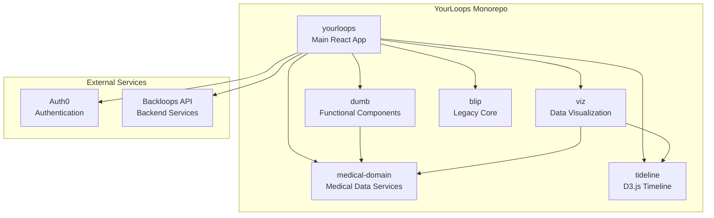

# YourLoops (Blip)

[](https://github.com/mdblp/blip/actions/workflows/ci.yml)

YourLoops is a web application for type 1 diabetes (T1D) management developed by [Diabeloop](https://www.diabeloop.com/). It allows patients and their care team (family, healthcare providers) to visualize diabetes device data (insulin pumps, BGMs, CGMs) and communicate with each other.

## Architecture Overview



## Documentation

For detailed documentation, see the [Developer Guide](docs/StartHere.md):

- [Architecture Overview](docs/Architecture.md)
- [Packages Documentation](docs/Packages.md)
- [Directory Structure](docs/DirectoryStructure.md)
- [Authentication](docs/Authentication.md)
- [Data Flow](docs/DataFlow.md)
- [Internationalization](docs/Internationalization.md)

* * * * *

### Table of Contents

- [Before You Start](#before-you-start)
- [Install](#install)
- [Build and Deployment](#build-and-deployment)
- [Configuration](#configuration)
- [Run a Production Server Locally](#run-a-production-server-locally)
- [Debugging](#debugging)
- [Linting](#linting)
- [Running the Tests](#running-the-tests)
- [Copyright Management](#copyright-management)

## Before You Start

If this is your first time setting up YourLoops locally, start with the [yourloops/k8s](https://github.com/mdblp/yourloops/tree/next/k8s) repository to setup the Backloops backend services before continuing here.

## Install

### Requirements

- [NVM](https://github.com/nvm-sh/nvm) - Node Version Manager (recommended)
- [Node.js](http://nodejs.org/) version 16.x or higher
- [npm](https://www.npmjs.com/) version 8.x or higher

### Quick Start

```bash
# Clone the repository
git clone https://github.com/mdblp/blip.git
cd blip

# Use the correct Node version (if using nvm)
nvm use

# Install dependencies
npm install
```

> **Note:** If you have a different major version of node installed, use [nvm](https://github.com/creationix/nvm) to manage and switch between multiple node installations. Update npm with: `npm install -g npm@latest`

## Build and deployment

### Configuration
To configure blip to the desired environment source one config in the `config` directory.
Example for a dev build:
```bash
$ source config/.env.sh
```

### Simple dev build

The app is built as a static site in the `dist/` directory.

- Will load the env var for a dev environment (docker)
- Do a development build of the application
```bash
$ npm run build-dev
```

### Watch dev build
This will build the application and launch a dev server, with "watch" option.
Everytime a file is changed in the source, the application will be re-build automatically,
and the changes will be available in the browser

```bash
$ npm run start-dev
```

The application will be available at: http://localhost:3001/
Hit `CTRL+C` to stop the server.

### Production build

```bash
$ bash build.sh
```

## Run a production server locally

After that, the app is ready to be served using the static web server included in this repo:

```bash
$ npm run server
```

You can specify the HTTP port using the `PORT` env var:
```bash
$ PORT=3001 npm run server
```

## Debugging

The app uses the [bows](http://latentflip.com/bows/) library to log debugging messages to the browser's console. It is disabled by default (which makes it production-friendly). To see the messages type `localStorage.debug = true` in the browser console and refresh the page. Create a logger for a particular app module by giving it a name, such as:

```javascript
app.foo = {
  log: bows('Foo'),
  bar: function() {
    this.log('Walked into a bar');
  }
};
```

## Linting

The app is ruled by [eslint](https://eslint.org/) to keep code style consistent. It has an [editorconfig](https://editorconfig.org/) file which defines some common rules to correctly configure IDE formatting.
How to enable it :
- VS code : download and install the [EditorConfig](https://marketplace.visualstudio.com/items?itemName=EditorConfig.EditorConfig) plugin
- Webstorm : enable the EditorConfig support into Settings / Code style

## Running the tests

This section does not apply to test defined in package "yourloops". More information about "yourloops" tests can be found at `/packages/yourloops/README.md`.
We use [Mocha](https://mochajs.org/) with [Chai](http://chaijs.com/) for our test framework inside [Karma](https://karma-runner.github.io/) as our test runner, as well as [Sinon.JS](http://sinonjs.org/) and [Sinon-Chai](https://github.com/domenic/sinon-chai) for spies and stubs. Our tests currently run on Google Chrome or Firefox (if not using WSL).

To run the unit tests, use:

```bash
// run all test
$ npm run test
// run a specific package, either sundiaal, viz, tideline, blip or yourloops
$ npm run test-<the targeted package>
```

To debug unit test, use:

```bash
$ npm run test-yourloops-debug
```
Once webpack has built, go to http://localhost:9876 to run the test. Click on the debug button, open devtools, go to "Sources" and open the file to debug. Breakpoints can be used (in devtools).

To run specific test(s), use :
```javascript
describe.only('test name')
//or
it.only('test name')
```

## Independent server for production or docker

For a production ready archive, or an independent docker image, the `server` directory is used.
To do it automatically, see the `artifact.sh` usage.

To do it manually, fist be sure to set the environment variables needed (see the [Configuration](#configuration) part).

```bash
# Build the application
:blip$ npm run build
# Move the created app (static web files) to the server directory:
:blip$ mv -v dist server/dist
# Update blip the version in the package.json on the server side:
:blip$ bash server/update-version.sh
# Go to the server directory
:blip$ cd server
# Install the node dependencies
:blip/server$ npm install
# Run the server
:blip/server$ bash start.sh
# Or build the docker image:
:blip/server$ docker build -t blip:latest .
# Start the docker server:
:blip/server$ docker run -p 3000:3000 blip:dev
```

## Integration with CloudFront
Blip is designed to be published on AWS Cloudfront. The "static" js and html content (result of webpack) is published on an s3 bucket and the configuration and security stuff is handled by a lambda edge function.

### Local testing
To test blip locally as if it was running on CloudFront with a lambda@edge middleware you can execute the following command (from root dir):
* launch a docker container docker lambci/lambda:nodejs10.x in "watch mode": `docker run --rm -e DOCKER_LAMBDA_WATCH=1 -e DOCKER_LAMBDA_STAY_OPEN=1 -p 9001:9001 -v $PWD/dist/lambda:/var/task:ro,delegated -d --name blip-middleware lambci/lambda:nodejs10.x cloudfront-test-blip-request-viewer.handler` assuming you compile the lambda script with $TARGET_ENVIRONMENT=test.
* the docker container will pickup any changes you apply to the lambda script
* source the relevant env file: `. ./config/.env.sh`
* then start blip server to serve static js files: `npm run server`

### Deploy and test on a k8s cluster
To run blip on k8s (or even on a simple docker compose) you can re-use the deployment image.
Create a deployment with 2 pods:
* lambci/lambda:nodejs10.x to execute the lambda
* node:10-alpine to execute the server
Attach these 2 pods to a volume and use an init container to copy the app files (lambda script + static dist) on the volume.
`docker run -v blip:/www --env-file .docker.env blip-deployment "-c" "cd server && npm run gen-lambda && cp -R /dist/static /www && cp -R /dist/lambda /static"`

### Deploy to aws cloud front
To publish blip to CloudFront the simplest solution is to build the docker image provided under ./cloudfront-dist and use it.
1. From the root folder execute: `docker build -t blip-deploy .`
2. Prepare an environment file that contains the configuration for the environment you want to deploy to. You can use the template provided in ./cloudfront-dist/docker.template.env.
3. Execute the docker image built just above: `docker run --env-file ./cloudfront-dist/deployment/cf-blip.env blip-deploy`
Et voila, the deployment starts. Of course you need credentials for the aws account you target ;)

## Documentation for developers

[how to test the GitHub workflow](docs/howto-manualy-run-a-workflow.md)


:warning: this part below contains deprecated contents, inhereted from tidepool

+ [Blip developer guide](docs/StartHere.md)
    + [overview of features](docs/FeatureOverview.md)
    + [app & directory structure](docs/DirectoryStructure.md)
    + [architecture](docs/Architecture.md)
    + [code style](docs/CodeStyle.md)
    + [webpack](docs/Webpack.md)


## Copyright management
The copyright profile "Diabeloop" can be found in `Preferences | Editor | Copyright`.

### Enable copyright update on save
To enable the automatic copyright update on file save
- Go to `Preferences | Tools | Actions on save`
- Check the box "Update copyright notice"

### Copyright text
To update the text of the copyright, go to `Preferences | Editor | Copyright | Copyright profiles`.

As the copyright text is shared at project-level, do not forget to commit the changes to the file `.idea/Diabeloop.xml`.

## Version management
A NPM script allows to automatically update the version of all packages:
```shell
$ VERSION=<VERSION_NUMBER> npm run bump-version
```

This script will update the package version of:
- all packages in the NPM workspace
- the `server` package
- the `cloudfront-dist/deployment` package

### Other
For more copyright management options, check the [IntelliJ documentation](https://jetbrains.com/help/idea/copyright.html).
