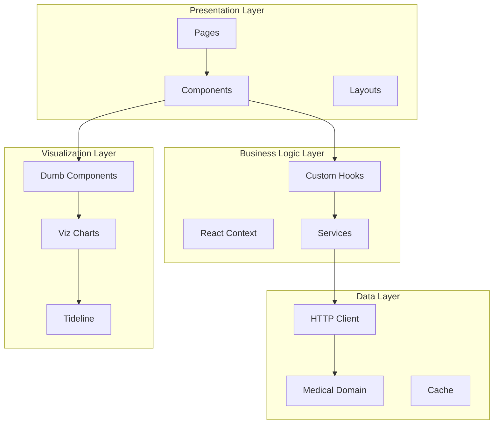

# Architecture

This document describes the architecture of the YourLoops frontend application.

## High-Level Architecture


## Application Layers

### Layer Architecture



### Layer Responsibilities

| Layer              | Package                   | Responsibility                      |
|--------------------|---------------------------|-------------------------------------|
| **Presentation**   | `yourloops`               | UI rendering, user interactions     |
| **Business Logic** | `yourloops/lib`           | Application logic, state management |
| **Data**           | `medical-domain`          | Data normalization, validation      |
| **Visualization**  | `dumb`, `viz`, `tideline` | Charts, graphs, statistics          |

## Component Architecture

### Component Types


| Type                     | Location               | Characteristics              |
|--------------------------|------------------------|------------------------------|
| **Page Components**      | `pages/`               | Route-level, data fetching   |
| **Container Components** | `components/`          | State management, logic      |
| **UI Components**        | `components/`, `dumb/` | Presentational, props-driven |

### Component Example

```typescript
// Smart Component (Page)
// packages/yourloops/pages/patient/patient-dashboard.tsx
const PatientDashboard: FC = () => {
  const { data, loading } = useMedicalData(patientId)

  return (
    <MainLayout>
      <DashboardHeader patient={patient} />
      <StatisticsCard data={data} loading={loading} />
      <TimelineChart data={data} />
    </MainLayout>
  )
}

// Dumb Component
// packages/dumb/src/components/stats/statistics-card.tsx
const StatisticsCard: FC<StatisticsCardProps> = ({
  data,
  loading
}) => {
  if (loading) return <Skeleton />
  return <Card>{/* render statistics */}</Card>
}
```

## Data Fetching Strategy

### Fetch Pattern


### Loading States

We follow the pattern of "render as soon as possible":

| State      | `data`   | `loading` | UI Behavior            |
|------------|----------|-----------|------------------------|
| Initial    | `null`   | `true`    | Show skeleton          |
| Empty      | `null`   | `false`   | Show "no data" message |
| Loaded     | `object` | `false`   | Display data           |
| Refreshing | `object` | `true`    | Show data + indicator  |

## State Management

### State Architecture


### State Providers

```typescript
// packages/yourloops/app/app.tsx
<Auth0Provider>
  <AuthContextProvider>
    <ThemeProvider>
      <SnackbarContextProvider>
        <MainLobby />
      </SnackbarContextProvider>
    </ThemeProvider>
  </AuthContextProvider>
</Auth0Provider>
```

## Routing Architecture

### Route Structure


### Route Protection

Routes are protected by the `MainLobby` component which:
1. Checks authentication status
2. Validates user consent
3. Enforces training completion
4. Redirects as needed

## Error Handling

### Error Boundary Pattern


### Error Types

| Type           | Handling           | User Experience     |
|----------------|--------------------|---------------------|
| **Network**    | Retry with backoff | Toast notification  |
| **Auth**       | Redirect to login  | Login page          |
| **Validation** | Display inline     | Form error messages |
| **Critical**   | Error boundary     | Error page          |

## Performance Patterns

### Optimization Strategies


| Strategy           | Implementation       | Benefit                |
|--------------------|----------------------|------------------------|
| **Code Splitting** | `React.lazy()`       | Smaller initial bundle |
| **Memoization**    | `useMemo`, `memo`    | Prevent re-renders     |
| **Data Windowing** | Date range filtering | Reduce data volume     |
| **Virtualization** | Virtual lists        | Handle large datasets  |

## Security Architecture

### Security Layers


### Security Measures

- **Authentication**: Auth0 with JWT tokens
- **Authorization**: Role-based access control
- **Data Protection**: HTTPS, secure cookies
- **Session**: Automatic timeout, secure refresh

---

## See Also

- [Packages](./Packages.md) - Package details
- [Authentication](./Authentication.md) - Auth flow
- [Data Flow](DataFlow.md) - Data processing
- [Directory Structure](./DirectoryStructure.md) - Code organization
