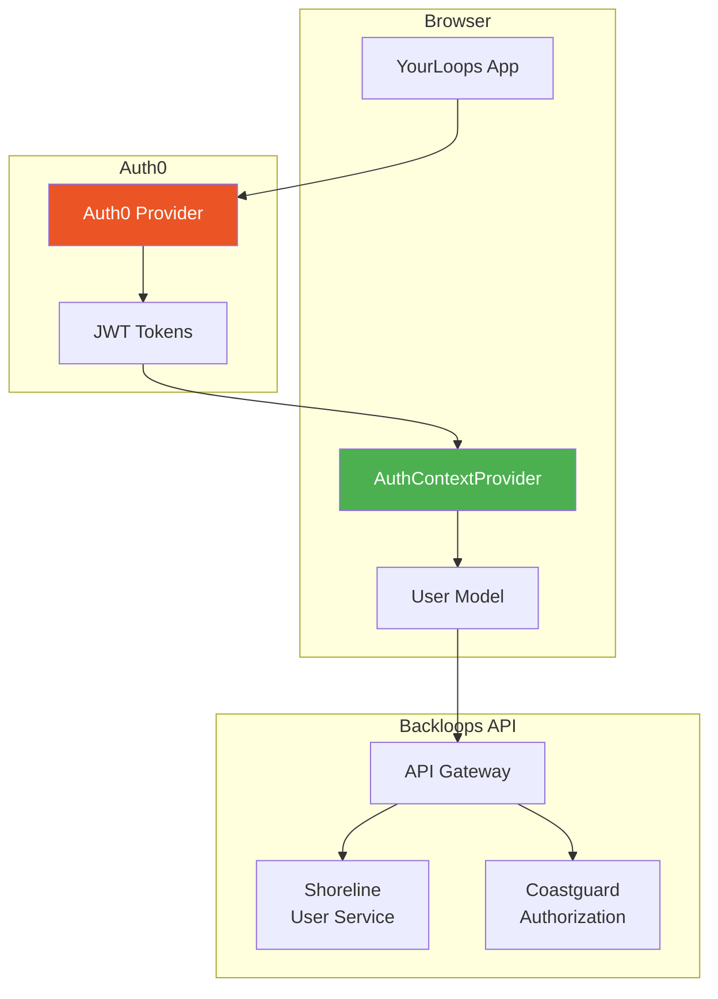
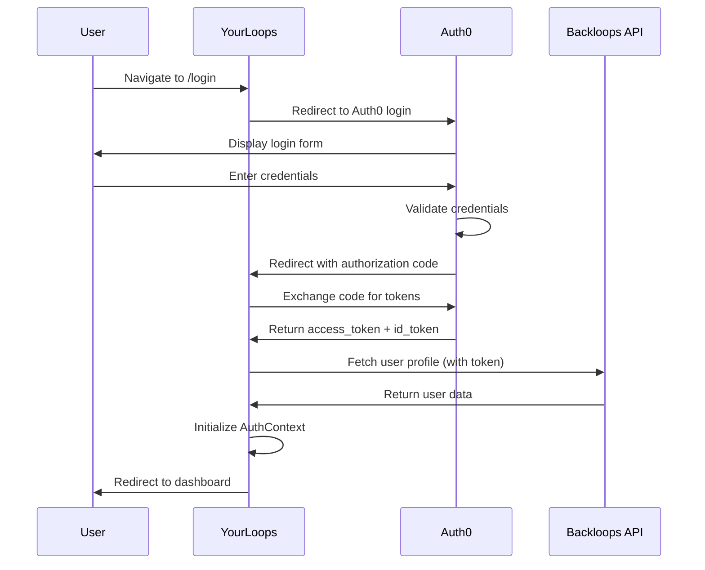
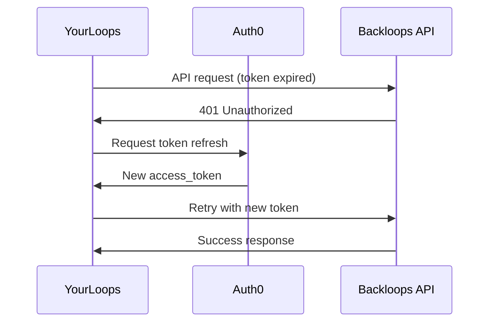
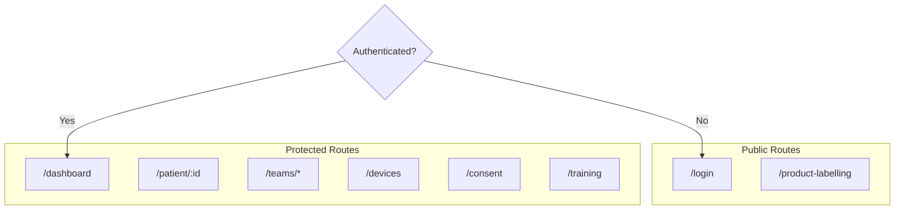
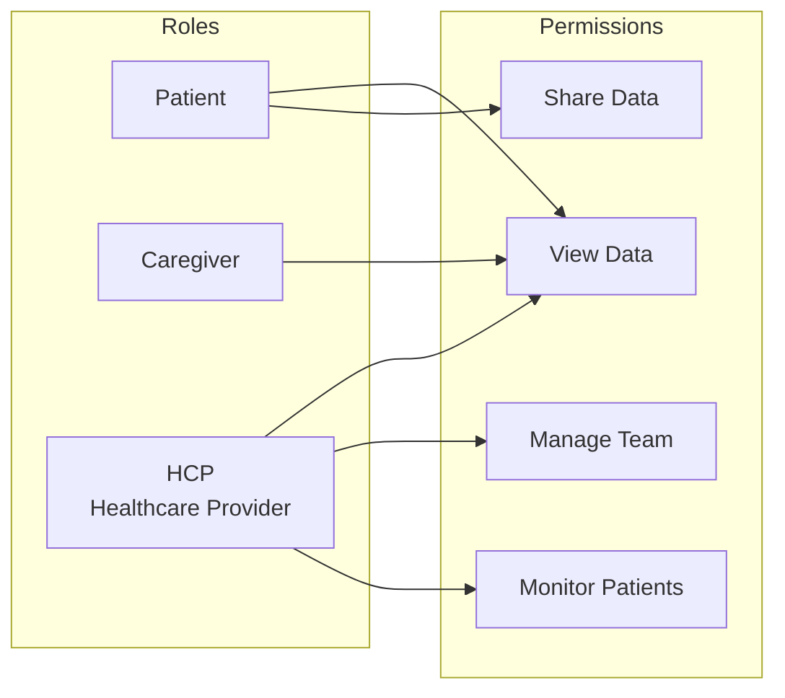

# Authentication

YourLoops uses [Auth0](https://auth0.com/) for authentication and authorization.
This document describes the authentication flow and integration patterns and the high-level permissions model.

## Architecture Overview



## Authentication Flow

### Login Sequence



### Token Refresh



## Implementation

### Application Entry Point

The Auth0Provider wraps the entire application at the root level:

```typescript
// packages/yourloops/app/app.tsx
import { Auth0Provider } from '@auth0/auth0-react'

export const Yourloops: FC = () => {
  return (
    <Auth0Provider
      domain={appConfig.AUTH0_DOMAIN}
      issuer={appConfig.AUTH0_ISSUER}
      clientId={appConfig.AUTH0_CLIENT_ID}
      useRefreshTokensFallback
      authorizationParams={{
        redirect_uri: window.location.origin,
        audience: 'https://api-ext.your-loops.com'
      }}
      useRefreshTokens
    >
      <BrowserRouter>
        <AuthContextProvider>
          <MainLobby />
        </AuthContextProvider>
      </BrowserRouter>
    </Auth0Provider>
  )
}
```

### Auth Context

The `AuthContextProvider` manages user state and provides authentication utilities:

```typescript
// packages/yourloops/lib/auth/auth.hook.tsx
import { useAuth0 } from '@auth0/auth0-react'

export const AuthContextProvider: FC<PropsWithChildren> = ({ children }) => {
  const { isAuthenticated, user, getAccessTokenSilently } = useAuth0()

  // User initialization and state management
  // ...

  return (
    <AuthContext.Provider value={authContext}>
      {children}
    </AuthContext.Provider>
  )
}

export const useAuth = () => useContext(AuthContext)
```

### User Model

The User class encapsulates user data and authentication state:

```typescript
// packages/yourloops/lib/auth/models/user.model.ts
class User {
  // User properties
  id: string
  email: string
  role: UserRole

  // State checks
  isFirstLogin(): boolean
  hasToAcceptNewConsent(): boolean
  hasToRenewConsent(): boolean
  hasToDisplayTrainingInfoPage(): boolean
}
```

## Route Protection

### Route Categories

YourLoops routes are divided into two categories.
You will find below the main routes (not the exaustive list)
you can find the complete list in the [routes.enum.ts](../packages/yourloops/models/enums/routes.enum.ts)



### Redirect Logic

The `MainLobby` component handles route protection and redirects.

## Session Management

### Idle Timeout

YourLoops implements automatic logout after user inactivity:

```typescript
import { useIdleTimer } from 'react-idle-timer'

const onIdle = (): void => {
  if (isLoggedIn) {
    logout(true)
  }
}

useIdleTimer({ timeout: ConfigService.getIdleTimeout(), onIdle })
```

### Configuration

| Setting           | Description                 | Default         |
|-------------------|-----------------------------|-----------------|
| `AUTH0_DOMAIN`    | Auth0 tenant domain         | Required        |
| `AUTH0_CLIENT_ID` | Auth0 application client ID | Required        |
| `AUTH0_ISSUER`    | Token issuer URL            | Required        |
| `IDLE_TIMEOUT`    | Session idle timeout (ms)   | 900000 (15 min) |

## API Authentication

### Adding Token to Requests

```typescript
// packages/yourloops/lib/http/http.service.ts
const getAuthHeaders = async () => {
  const token = await getAccessTokenSilently()
  return {
    Authorization: `Bearer ${token}`,
    'Content-Type': 'application/json'
  }
}
```

### Token Audience

The API token is configured with a specific audience to ensure it's only valid for YourLoops backend services:

```
audience: 'https://api-ext.your-loops.com'
```

## User Roles



| Role        | Description                                                |
|-------------|------------------------------------------------------------|
| `patient`   | Can view own data, share with caregivers/HCPs              |
| `caregiver` | Can view shared patient data                               |
| `hcp`       | Healthcare provider, can manage teams and monitor patients |

## Error Handling

### Authentication Errors

| Error              | Cause                   | Resolution              |
|--------------------|-------------------------|-------------------------|
| `login_required`   | Session expired         | Redirect to login       |
| `consent_required` | User consent needed     | Show consent page       |
| `invalid_token`    | Token validation failed | Clear session, re-login |

### Error Handler Example

```typescript
try {
  await getAccessTokenSilently()
} catch (error) {
  if (error.error === 'login_required') {
    loginWithRedirect()
  }
}
```

## Security Best Practices

1. **Token Storage**: Tokens are stored in memory, not localStorage
2. **Refresh Tokens**: Silent refresh maintains sessions securely
3. **HTTPS Only**: All authentication traffic over HTTPS
4. **Audience Validation**: Tokens validated for the correct audience
5. **Idle Timeout**: Automatic logout after inactivity

---

## See Also

- [Architecture](./Architecture.md)
- [Data Flow](DataFlow.md)
- [Auth0 Documentation](https://auth0.com/docs)

