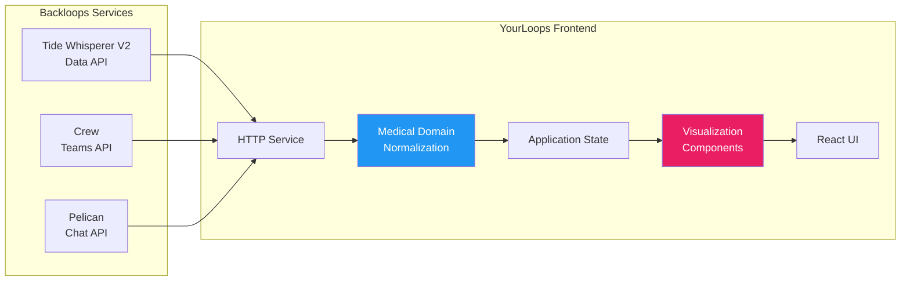
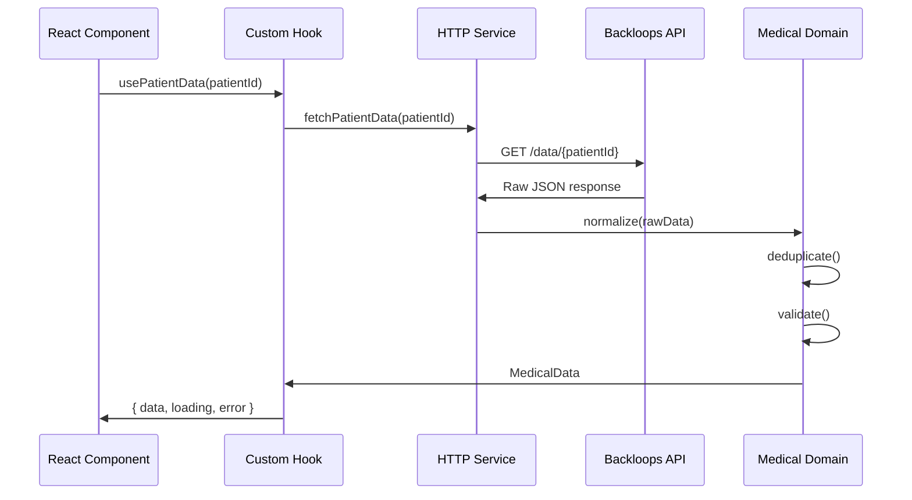
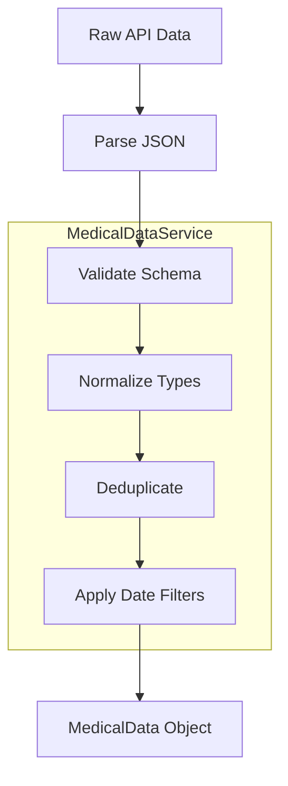
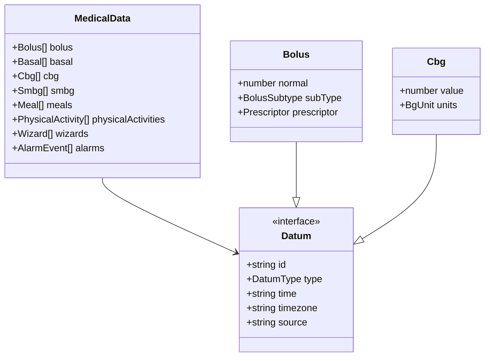
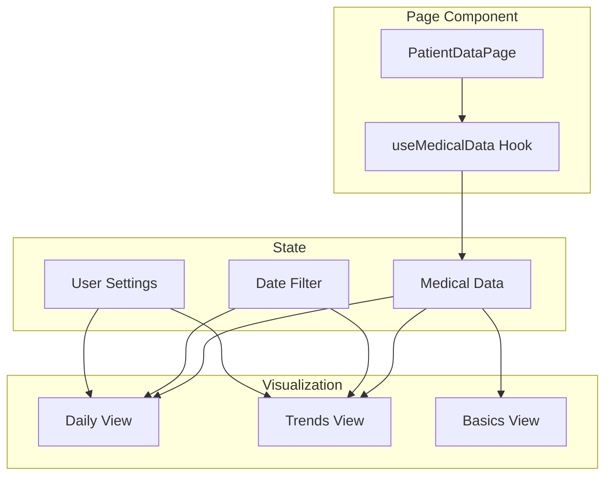
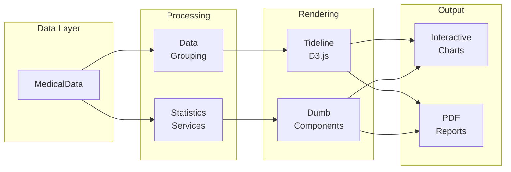
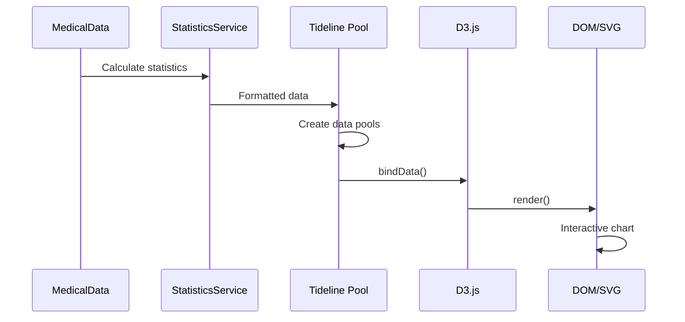
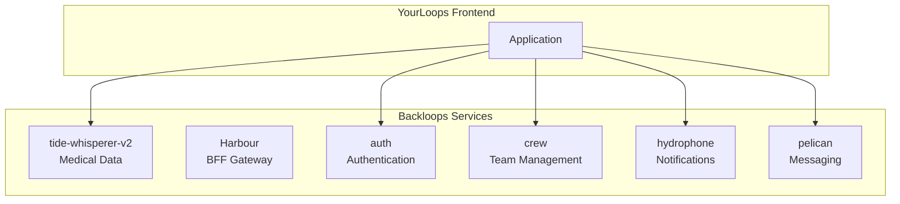
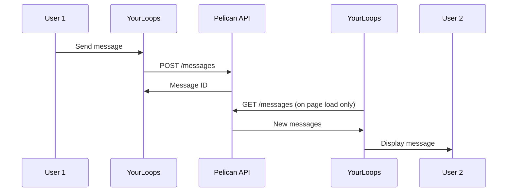
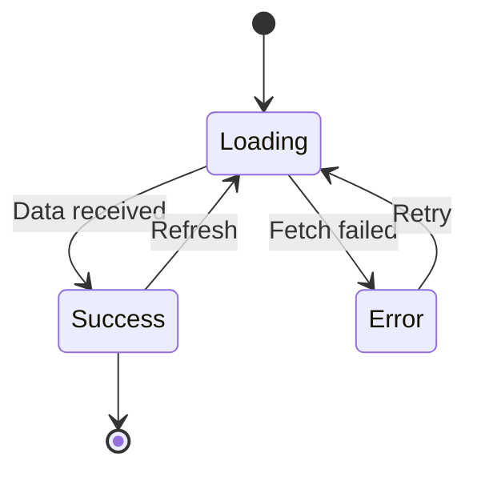

# Data Flow

This document describes how data flows through the YourLoops application, from backend APIs to user interface rendering.

## Overview

In order to not overwhelm the diagram, not all services are shown.


## Data Fetching

### API Communication



### HTTP Service Layer

Located in `packages/yourloops/lib/http/`:

```typescript
// Simplified example
class HttpService {
  async get<T>(endpoint: string): Promise<T> {
    const token = await this.getAccessToken()
    const response = await fetch(`${API_BASE}${endpoint}`, {
      headers: {
        Authorization: `Bearer ${token}`,
        'Content-Type': 'application/json'
      }
    })
    return response.json()
  }
}
```

## Medical Data Processing

### Normalization Pipeline



### Data Types

In order to not overwhelm the diagram, not all types are shown.


### MedicalDataService

```typescript
// packages/medical-domain/src/domains/repositories/medical/medical-data.service.ts
class MedicalDataService {
  /**
   * Normalize raw data from API
   */
  normalize(rawData: unknown[]): MedicalData {
    // Type detection and normalization
  }

  /**
   * Remove duplicate entries
   */
  deduplicate(data: MedicalData): MedicalData {
    // Deduplication by ID and timestamp
  }

  /**
   * Filter by date range
   */
  filterByDateRange(
    data: MedicalData,
    filter: DateFilter
  ): MedicalData {
    // Date-based filtering
  }
}
```

## State Management

### Data Flow in Components



### Custom Hooks Pattern

```typescript
// packages/yourloops/lib/data/use-medical-data.hook.ts
export const useMedicalData = (patientId: string, dateFilter: DateFilter) => {
  const [data, setData] = useState<MedicalData | null>(null)
  const [loading, setLoading] = useState(true)
  const [error, setError] = useState<Error | null>(null)

  useEffect(() => {
    const fetchData = async () => {
      try {
        setLoading(true)
        const rawData = await httpService.getPatientData(patientId, dateFilter)
        const normalizedData = medicalDataService.normalize(rawData)
        setData(normalizedData)
      } catch (err) {
        setError(err)
      } finally {
        setLoading(false)
      }
    }
    fetchData()
  }, [patientId, dateFilter])

  return { data, loading, error }
}
```

## Visualization Pipeline

### From Data to Charts



### Statistics Calculation

```typescript
// Calculate glycemia statistics
const glycemiaStats = GlycemiaStatisticsService.calculate(
  medicalData.cbg,
  bgBounds,
  dateFilter
)

// Result includes:
// - Time in Range (TIR)
// - Average glucose
// - Standard deviation
// - Glucose Management Indicator (GMI)
```

### Chart Rendering Flow



## Backend Services Integration

### Service Map



### Main API Endpoints

| Service             | Purpose                                   | Key Endpoints                     |
|---------------------|-------------------------------------------|-----------------------------------|
| `tide-whisperer-v2` | Medical data access                       | `GET /data/v2/all/{userId}`       |
| `harbour`           | Backend for front end (aggration gateway) | `GET /bff/v1/*`                   |
| `crew`              | Team management                           | `GET /teams`, `POST /teams`       |
| `hydrophone`        | Email notifications                       | `POST /send`                      |
| `pelican`           | Chat/messaging                            | `GET /messages`, `POST /messages` |

### Chat/Messaging Flow



## Error Handling

### Data Fetch Errors

the http service will throw an error if the response status code is not 2xx.

```typescript
private static handleError(error: AxiosError, excludedErrorCodes: number[] = []): Error {
  if (!error.response || excludedErrorCodes.includes(error.response.status)) {
    return error
  }

  if (error.response.status >= 400 && error.response.status <= 550) {
    switch (error.response.status) {
      case HttpStatus.StatusNotFound:
        throw Error(ErrorMessageStatus.NotFound)
      case HttpStatus.StatusInternalServerError:
        throw Error(t('error-http-500'))
      default:
        throw Error(t('error-http-40x'))
    }
  }
}
```

then the error will be handled in the component or the custom hook, most of the time using this pattern below:

```typescript
const funcName = useCallback(async (userid: string): Promise<void> => {
  setRefreshInProgress(true)
  try {
    const dataNeeded = await nameOfApiToCall(userid) // to change of course
      ...
  } catch (err) {
    const errorMessage = errorTextFromException(err)
    logError(errorMessage, 'fetch-patient-infos')
    alert.error(t('error-http-40x'))
    // Reset to minimal patient state on error
      ...
  } finally {
    setRefreshInProgress(false)
  }
}, [alert, t])
```

### Error States in UI



## Performance Considerations

1. **Lazy Loading**: patient list metrics loaded on demand
2. **Data Windowing**: Only visible date range loaded
3. **Memoization**: Expensive calculations cached
4. **Web Workers**: Heavy processing off main thread, (not yet implemented, can be a future improvement)

---

## See Also

- [Packages](Packages.md) - Package responsibilities
- [Architecture](Architecture.md) - Overall architecture
- [Authentication](Authentication.md) - Auth flow details

