# Data Flow

This document describes how data flows through the YourLoops application, from backend APIs to user interface rendering.

## Overview

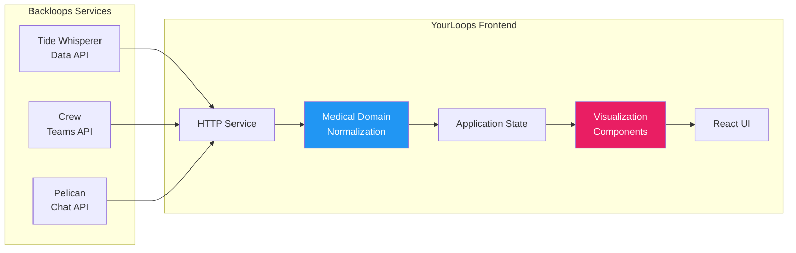

## Data Fetching

### API Communication

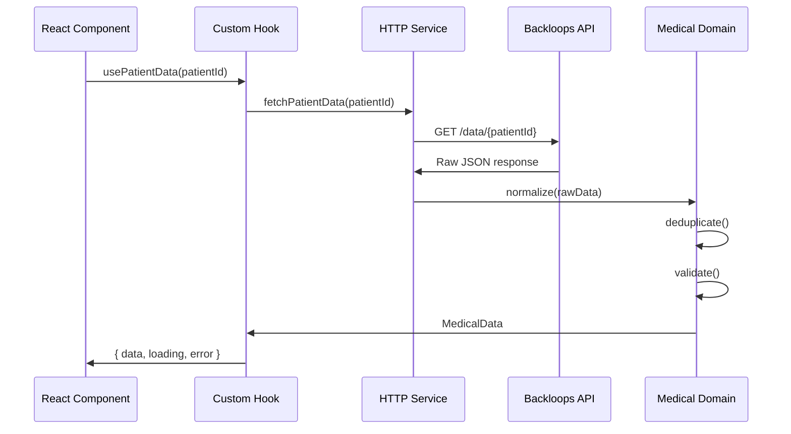

### HTTP Service Layer

Located in `packages/yourloops/lib/http/`:

```typescript
// Simplified example
class HttpService {
  async get<T>(endpoint: string): Promise<T> {
    const token = await this.getAccessToken()
    const response = await fetch(`${API_BASE}${endpoint}`, {
      headers: {
        Authorization: `Bearer ${token}`,
        'Content-Type': 'application/json'
      }
    })
    return response.json()
  }
}
```

## Medical Data Processing

### Normalization Pipeline

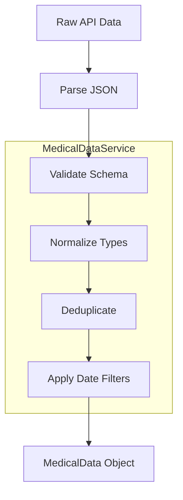

### Data Types

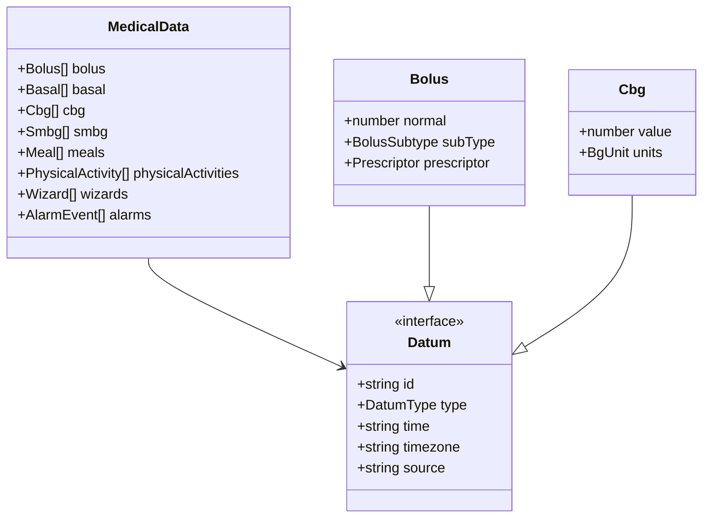

### MedicalDataService

```typescript
// packages/medical-domain/src/domains/repositories/medical/medical-data.service.ts
class MedicalDataService {
  /**
   * Normalize raw data from API
   */
  normalize(rawData: unknown[]): MedicalData {
    // Type detection and normalization
  }

  /**
   * Remove duplicate entries
   */
  deduplicate(data: MedicalData): MedicalData {
    // Deduplication by ID and timestamp
  }

  /**
   * Filter by date range
   */
  filterByDateRange(
    data: MedicalData,
    filter: DateFilter
  ): MedicalData {
    // Date-based filtering
  }
}
```

## State Management

### Data Flow in Components

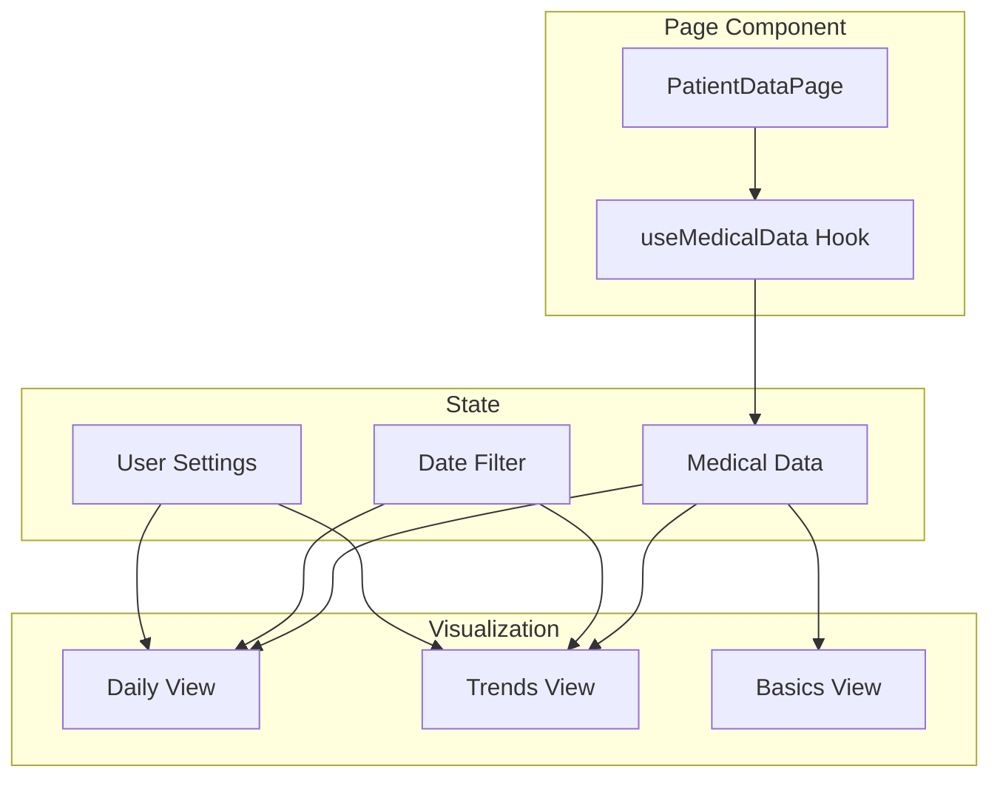

### Custom Hooks Pattern

```typescript
// packages/yourloops/lib/data/use-medical-data.hook.ts
export const useMedicalData = (patientId: string, dateFilter: DateFilter) => {
  const [data, setData] = useState<MedicalData | null>(null)
  const [loading, setLoading] = useState(true)
  const [error, setError] = useState<Error | null>(null)

  useEffect(() => {
    const fetchData = async () => {
      try {
        setLoading(true)
        const rawData = await httpService.getPatientData(patientId, dateFilter)
        const normalizedData = medicalDataService.normalize(rawData)
        setData(normalizedData)
      } catch (err) {
        setError(err)
      } finally {
        setLoading(false)
      }
    }
    fetchData()
  }, [patientId, dateFilter])

  return { data, loading, error }
}
```

## Visualization Pipeline

### From Data to Charts

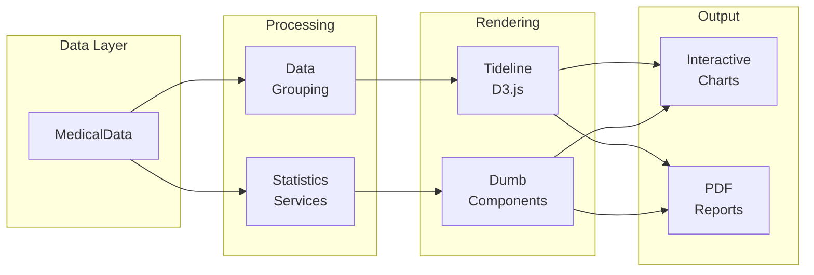

### Statistics Calculation

```typescript
// Calculate glycemia statistics
const glycemiaStats = GlycemiaStatisticsService.calculate(
  medicalData.cbg,
  bgBounds,
  dateFilter
)

// Result includes:
// - Time in Range (TIR)
// - Average glucose
// - Standard deviation
// - Glucose Management Indicator (GMI)
```

### Chart Rendering Flow

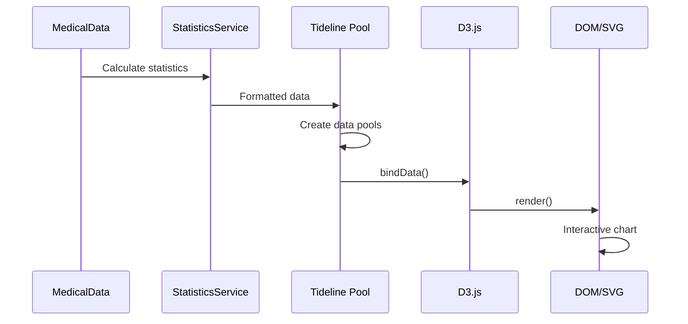

## Backend Services Integration

### Service Map

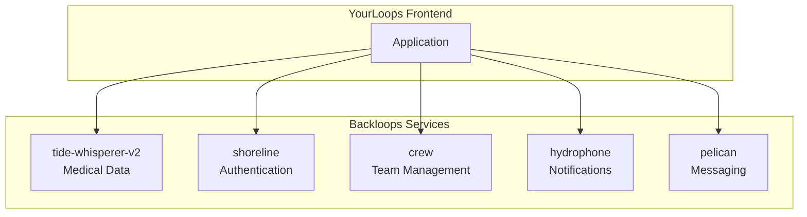

### API Endpoints

| Service | Purpose | Key Endpoints |
|---------|---------|---------------|
| `tide-whisperer-v2` | Medical data access | `GET /data/{userId}` |
| `shoreline` | User management | `GET /user`, `POST /user` |
| `crew` | Team management | `GET /teams`, `POST /teams` |
| `hydrophone` | Email notifications | `POST /send` |
| `pelican` | Chat/messaging | `GET /messages`, `POST /messages` |

## Caching Strategy

### Client-Side Caching

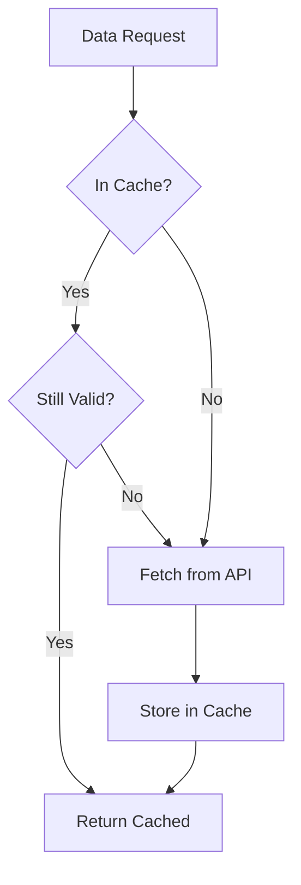

### Cache Invalidation

- **Time-based**: Data expires after configurable TTL
- **Event-based**: Cache cleared on user actions (e.g., data upload)
- **Navigation-based**: Fresh data fetched on page navigation

## Real-Time Updates

### Chat/Messaging Flow

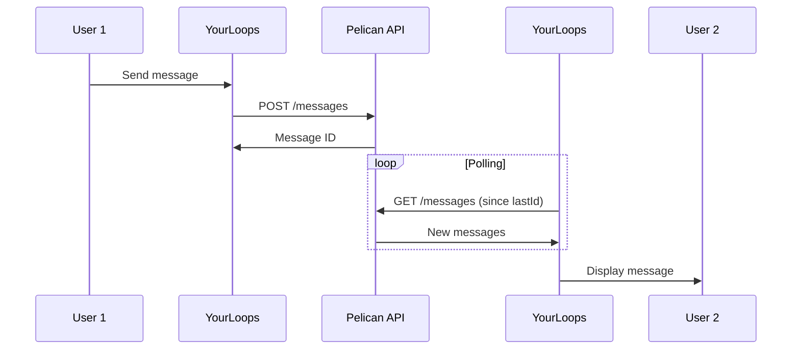

## Error Handling

### Data Fetch Errors

```typescript
try {
  const data = await fetchMedicalData(patientId)
} catch (error) {
  if (error instanceof NetworkError) {
    // Show offline message
  } else if (error instanceof AuthError) {
    // Redirect to login
  } else if (error instanceof ValidationError) {
    // Show data error message
  }
}
```

### Error States in UI

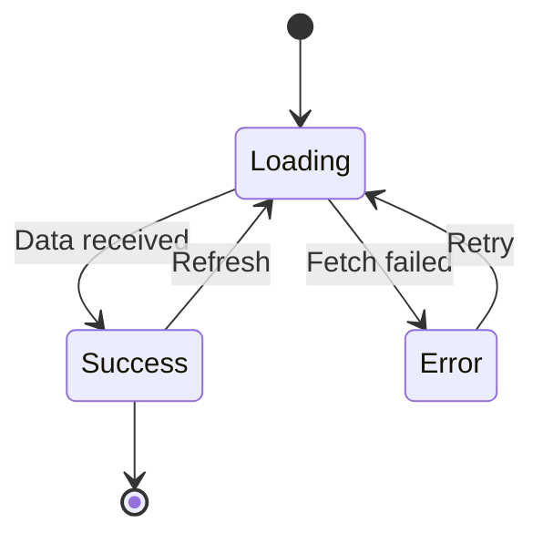

## Performance Considerations

1. **Lazy Loading**: Charts loaded on demand
2. **Data Windowing**: Only visible date range loaded
3. **Memoization**: Expensive calculations cached
4. **Web Workers**: Heavy processing off main thread

---

## See Also

- [Packages](Packages.md) - Package responsibilities
- [Architecture](Architecture.md) - Overall architecture
- [Authentication](Authentication.md) - Auth flow details

