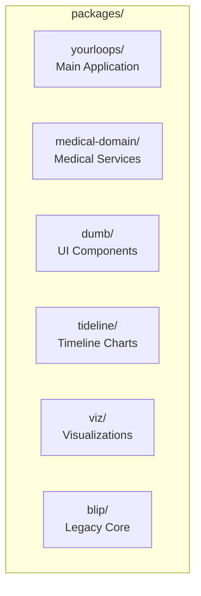

# Directory Structure

This document describes the directory structure of the YourLoops monorepo.

## Root Structure

```
blip/
├── packages/           # NPM workspaces (monorepo packages)
├── branding/          # Visual assets and theming
├── locales/           # Internationalization files
├── server/            # Production server
├── cloudfront-dist/   # AWS CloudFront deployment
├── docs/              # Documentation
├── public/            # Static public assets
├── config/            # Environment configuration
└── test/              # Root-level tests
```

## Monorepo Packages



### packages/yourloops/

The main React application package.

```
packages/yourloops/
├── app/                    # Application entry point
│   ├── app.tsx            # Root component with Auth0Provider
│   ├── main-lobby.tsx     # Main routing and layout
│   └── bootstrap.tsx      # Application bootstrap
│
├── pages/                  # Page-level components
│   ├── login/             # Login page
│   ├── signup/            # Signup flow
│   ├── patient/           # Patient dashboard
│   ├── patient-view/      # Patient data view
│   ├── hcp/               # Healthcare provider pages
│   ├── consent/           # Consent management
│   ├── training/          # Training pages
│   └── user-account/      # Account settings
│
├── components/             # Reusable components
│   ├── header-bars/       # Navigation headers
│   ├── footer/            # Application footer
│   ├── dialogs/           # Modal dialogs
│   ├── patient-data/      # Patient data display
│   ├── patient-list/      # Patient list components
│   ├── statistics/        # Statistics display
│   ├── chat/              # Chat/messaging components
│   ├── team/              # Team management
│   ├── buttons/           # Button components
│   ├── menus/             # Menu components
│   └── utils/             # Utility components
│
├── lib/                    # Services and utilities
│   ├── auth/              # Authentication (Auth0)
│   ├── config/            # Configuration service
│   ├── http/              # HTTP client
│   ├── data/              # Data services
│   ├── team/              # Team services
│   ├── patient/           # Patient services
│   ├── chat/              # Chat services
│   ├── notifications/     # Notification services
│   └── custom-hooks/      # React custom hooks
│
├── layout/                 # Layout components
│   └── main-layout.tsx    # Main application layout
│
├── models/                 # TypeScript interfaces
│   └── enums/             # Enumeration types
│
├── types/                  # Type definitions
├── utils/                  # Utility functions
├── images/                 # Image assets
├── css/                    # Global styles
└── test/                   # Tests
    ├── unit/              # Unit tests
    └── integration/       # Integration tests
```

### packages/medical-domain/

Medical data models and services.

```
packages/medical-domain/
├── src/
│   ├── index.ts           # Public API exports
│   └── domains/
│       ├── models/        # Data models
│       │   ├── medical/   # Medical data types
│       │   │   ├── datum/ # Individual data types
│       │   │   │   ├── bolus.model.ts
│       │   │   │   ├── basal.model.ts
│       │   │   │   ├── cbg.model.ts
│       │   │   │   └── enums/
│       │   │   └── medical-data.model.ts
│       │   ├── statistics/
│       │   └── time/
│       ├── repositories/  # Services
│       │   ├── medical/   # Medical data services
│       │   ├── statistics/# Statistics services
│       │   └── time/      # Time utilities
│       └── utils/         # Utility functions
└── test/                  # Tests
```

### packages/dumb/

Functional React components.

```
packages/dumb/
├── src/
│   ├── index.ts          # Public exports
│   ├── components/
│   │   ├── stats/        # Statistics components
│   │   ├── trends/       # Trend components
│   │   ├── tooltips/     # Tooltip components
│   │   └── controls/     # Control components
│   ├── models/           # Component models
│   ├── modules/          # Feature modules
│   ├── utils/            # Utilities
│   └── styles/           # Component styles
└── test/                 # Tests
```

### packages/tideline/

D3.js timeline visualization library.

```
packages/tideline/
├── js/
│   ├── index.js          # Main entry
│   ├── oneday.js         # One-day view
│   ├── pool.js           # Data pool management
│   ├── data/             # Data utilities
│   └── plot/             # Plot renderers
├── plugins/              # Visualization plugins
│   └── blip/             # Blip-specific plugins
├── css/                  # Styles
├── fonts/                # Font assets
└── test/                 # Tests
```

### packages/viz/

Data visualization components.

```
packages/viz/
├── src/
│   ├── index.js          # Public exports
│   ├── modules/          # Visualization modules
│   │   ├── print/        # PDF generation
│   │   └── trends/       # Trend visualizations
│   ├── styles/           # Visualization styles
│   ├── types/            # TypeScript types
│   └── utils/            # Utilities
├── data/                 # Sample data
├── docs/                 # Viz documentation
└── test/                 # Tests
```

### packages/blip/

Legacy core application module.

```
packages/blip/
├── app/
│   ├── core/             # Core utilities
│   ├── components/       # Legacy components
│   └── redux/            # Redux state (legacy)
└── test/                 # Tests
```

## Configuration Files

```
blip/
├── package.json           # Root package with workspaces
├── tsconfig.base.json     # Base TypeScript config
├── jest.config.js         # Jest test configuration
├── babel.config.json      # Babel configuration
├── .eslintrc.json         # ESLint configuration
├── .editorconfig          # Editor configuration
├── crowdin.yml            # Translation config
└── Dockerfile             # Docker build
```

## Key Entry Points

| File | Purpose |
|------|---------|
| `packages/yourloops/app/app.tsx` | Application root component |
| `packages/yourloops/app/main-lobby.tsx` | Main routing logic |
| `packages/medical-domain/src/index.ts` | Medical domain exports |
| `packages/dumb/src/index.ts` | Dumb components exports |
| `server/server.js` | Production server |

## Build Outputs

```
blip/
├── dist/                  # Production build output
│   ├── static/           # Compiled JS/CSS
│   └── public/           # Public assets
└── packages/*/dist/       # Package build outputs
```

---

## See Also

- [Packages](./Packages.md) - Detailed package documentation
- [Architecture](./Architecture.md) - Application architecture
- [Dependencies](./Dependencies.md) - External dependencies
