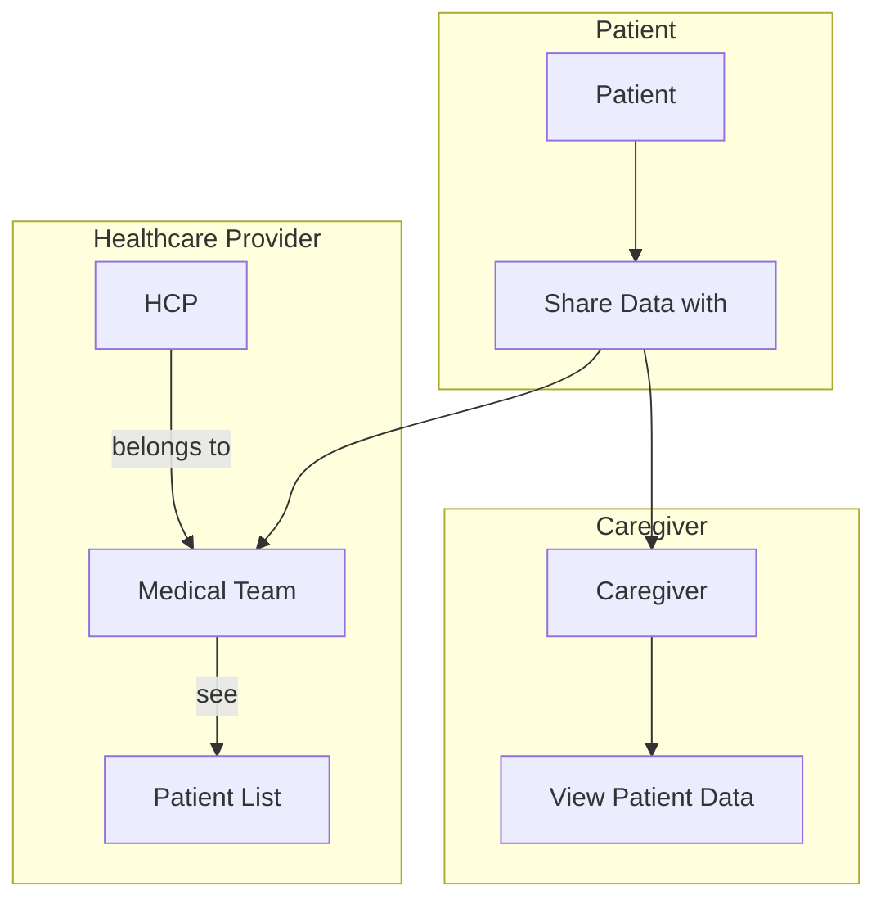
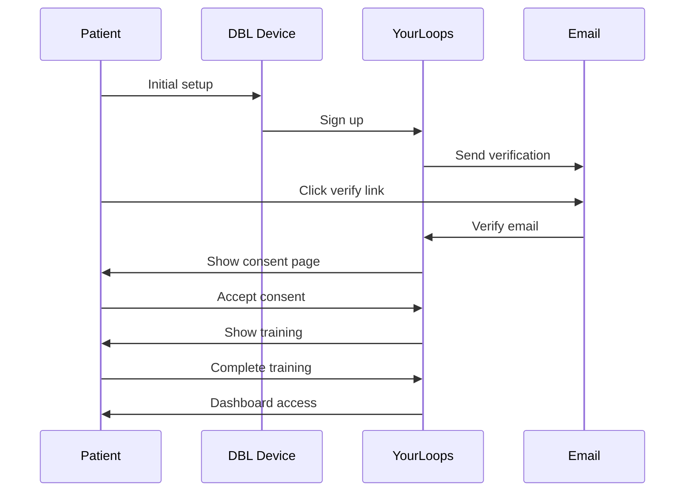
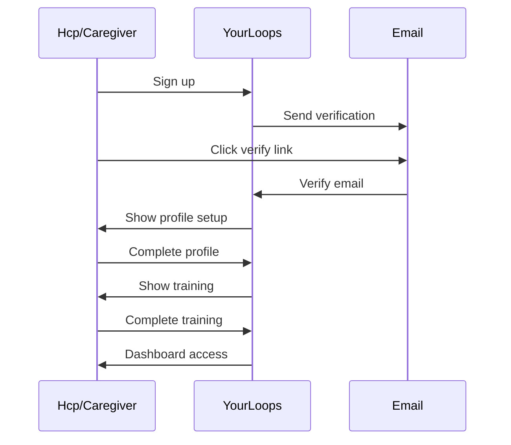

# Feature Overview

YourLoops is a web application for type 1 diabetes (T1D) management, enabling patients and their care teams to visualize diabetes device data and communicate effectively.

## User Roles

| Role          | Description                                         |
|---------------|-----------------------------------------------------|
| **Patient**   | Person with diabetes, manages own data and sharing  |
| **Caregiver** | Family member or friend with access to patient data |
| **HCP**       | Healthcare provider managing multiple patients      |

## Core Features

### 1. Account Management

- **Sign Up**: Create Tidepool/Diabeloop platform account
- **Email Verification**: Verify email address
- **Consent Management**: Accept Terms of Use and Privacy Policy
- **Profile Setup**: Configure personal and medical information
- **Account Settings**: Update email, password, preferences

### 2. Data Visualization

#### Basics View
General summary of all uploaded device data:
- Blood Glucose readings and distribution
- Infusion site changes
- Basal events
- Bolus events
- Time in Range statistics

#### Daily View
Detailed charts for a specific day:
- Timeline of all device data
- Basal:Bolus ratios
- Time in Target statistics
- Average blood glucose
- Notes and messages

#### Trends View
Analyze BGM or CGM trends over time:
- 1, 2, or 4 week analysis periods
- Statistical summaries

### 3. Default View Logic

The default view is determined by the most recent data type:

### 4. Team Management

this diagram shows the relationship between the different user roles: Patients, Healthcare Professional and Caregivers.

#### For Patients
- Share data with healthcare providers
- Invite caregivers
- Manage sharing permissions
- Revoke access

#### For Healthcare Providers
- Create and manage medical teams
- Invite patients to teams
- invite hcp members
- manage hcp permissions (member vs admin)
- Monitor multiple patients
- Access patient data with permission

#### For Caregivers
- Accept patient invitations
- View shared patient data
- Communicate with patients

### 5. Communication

simple messaging between patients and their care team (messages fetched after the login):
- Team-based chat
- Message notifications
- Unread message tracking

### 6. Medical Reports

- Generate PDF reports
- Export data for appointments
- Print-ready visualizations

## Device Support

### Supported Devices

| Device Type      | Data Collected                |
|------------------|-------------------------------|
| **DBLG1**        | Pump data, CGM, settings      |
| **DBLG2**        | Pump data, CGM, settings      |
| **CGM**          | Continuous glucose readings   |
| **Insulin Pump** | Basal, bolus, settings        |

### Data Types

## User Flows

### Patient Onboarding

the patient onboarding occurs only through the DBLx device during its initial setup.

### HCP and Caregivers Onboarding

### Data Sharing Flow

## Internationalization

YourLoops supports multiple languages:

| Language | Code |
|----------|------|
| English  | `en` |
| French   | `fr` |
| German   | `de` |
| Spanish  | `es` |
| Italian  | `it` |
| Dutch    | `nl` |
| Japanese | `ja` |

---

## See Also

- [Architecture](./Architecture.md) - Technical architecture
- [Data Flow](DataFlow.md) - How data flows through the app
- [Authentication](./Authentication.md) - User authentication
