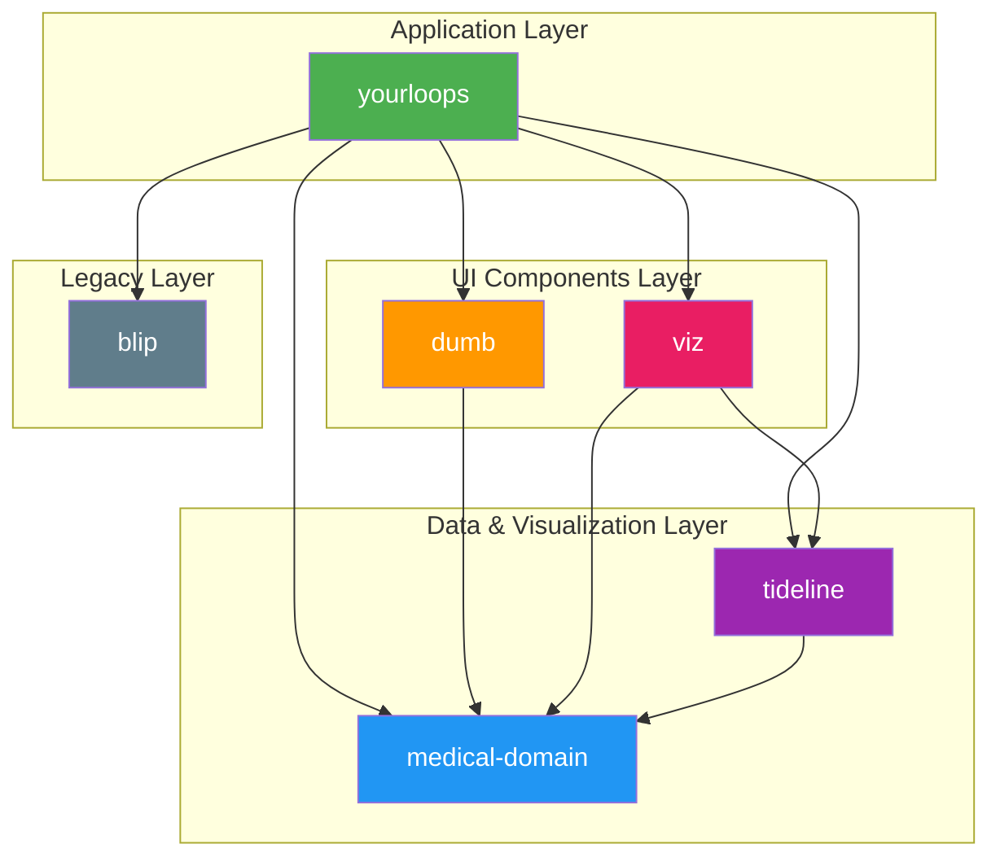
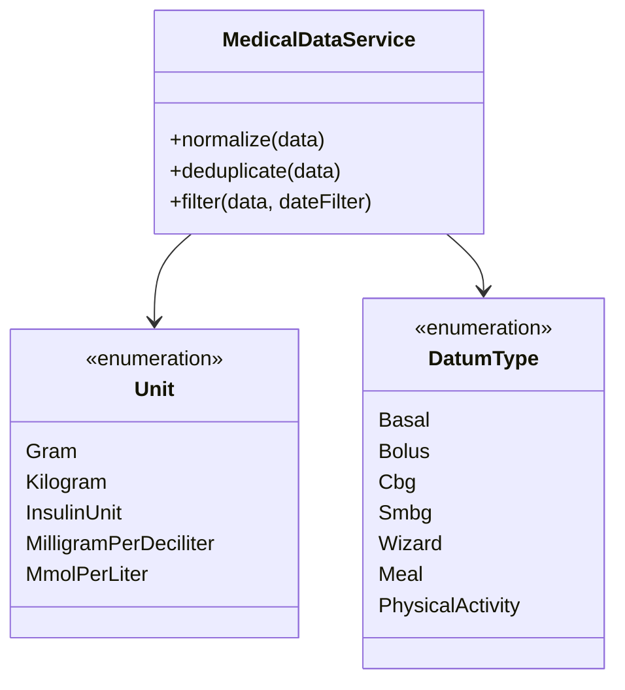
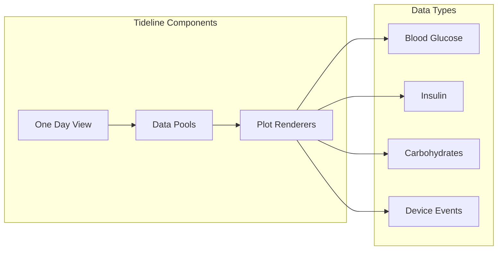

# Packages Documentation

YourLoops uses a monorepo architecture managed by npm workspaces. This document describes each package, its purpose, and
how they interconnect.

## Package Overview



## Packages

### 1. yourloops

**Location:** `packages/yourloops/`

The main React application that provides the user interface for YourLoops.

#### Purpose

- Entry point for the web application
- Authentication management (Auth0)
- Routing and navigation
- Page-level components
- API communication with Backloops services

#### Key Directories

| Directory     | Description                                            |
|---------------|--------------------------------------------------------|
| `app/`        | Application entry point and main layout                |
| `pages/`      | Page-level components (login, dashboard, patient view) |
| `components/` | Reusable UI components                                 |
| `lib/`        | Services, hooks, and utilities                         |
| `layout/`     | Layout components                                      |
| `models/`     | TypeScript interfaces and types                        |

#### Key Technologies

- React 18 with TypeScript
- React Router v6
- Auth0 for authentication
- Material-UI (MUI) for UI components
- i18next for internationalization

#### Entry Point

```typescript
// packages/yourloops/app/app.tsx
export const Yourloops: FC = () => {
  return (
    <Auth0Provider { ...auth0Config } >
    <BrowserRouter>
      <AuthContextProvider>
        <MainLobby / >
    </AuthContextProvider>
    < /BrowserRouter>
    < /Auth0Provider>
  )
}
```

---

### 2. medical-domain

**Location:** `packages/medical-domain/`

Centralizes medical data models, services, and utilities for diabetes management.

#### Purpose

- Define medical data types (Bolus, Basal, Cbg, etc.)
- Normalize and deduplicate medical data from backend services
- Provide statistics calculation services
- Handle unit conversions (mg/dL ↔ mmol/L)

#### Key Exports



#### Main Types

| Type                      | Description                                   |
|---------------------------|-----------------------------------------------|
| `alarmEvents`             | Alarm events                                  |
| `Bolus`                   | Insulin bolus data (meal, correction, manual) |
| `Basal`                   | Basal insulin delivery data                   |
| `Cbg`                     | Continuous Blood Glucose readings             |
| `Smbg`                    | Self-Monitored Blood Glucose readings         |
| `ConfidentialModes`       | Base medical data type                        |
| `DeviceParametersChanges` | Enumerated medical data types                 |
| `EatingShortlyEvents`     | Meal declared without details event data      |
| `Iob`                     | Insulin on board data                         |
| `Messages`                | Notes data                                    |
| `Wizard`                  | Meal and carbohydrate data                    |
| `Meal`                    | Rescue carbs data                             |
| `NightModes`              | Night mode events                             |
| `PhysicalActivity`        | Physical activity records                     |
| `PumpSettings`            | Pump settings data                            |
| `reservoirChanges`        | Reservoir Changes data                        |
| `WarmUps`                 | Warm Ups data                                 |
| `ZenModes`                | Zen Mode events                               |

#### Statistics Services

| Service                       | Description                                   |
|-------------------------------|-----------------------------------------------|
| `GlycemiaStatisticsService`   | Blood glucose statistics (TIR, average, etc.) |
| `BasalBolusStatisticsService` | Insulin delivery statistics                   |
| `CarbsStatisticsService`      | Carbohydrate intake statistics                |

---

### 3. dumb

**Location:** `packages/dumb/`

Functional React components rewritten from the `viz` package. All components are "dumb" (presentational) with no
internal state management.

#### Purpose

- Provide reusable, stateless UI components
- Modern functional React patterns
- Data visualization components for statistics and trends

#### Key Directories

| Directory              | Description                             |
|------------------------|-----------------------------------------|
| `components/stats/`    | Statistics display components           |
| `components/trends/`   | Trend visualization components          |
| `components/tooltips/` | Tooltip components for charts           |
| `components/controls/` | Control components (buttons, selectors) |

#### Design Philosophy

- Pure functional components
- Props-driven rendering
- No side effects
- Easy to test

---

### 4. tideline

**Location:** `packages/tideline/`

D3.js-based timeline visualization library for diabetes device data.

#### Purpose

- Render timeline-style data visualizations
- Handle complex multi-day data rendering
- Provide pooled data visualization (multiple data types in lanes)

#### Key Features



#### Dependencies

- [D3.js](https://d3js.org/) - Data visualization library
- [Crossfilter](https://crossfilter.github.io/crossfilter/) - Fast multidimensional filtering
- [Moment.js](https://momentjs.com/) - Date/time manipulation
- [Lodash](https://lodash.com/) - Utility library

---

### 5. viz

**Location:** `packages/viz/`

Data visualization components for diabetes device data, built on top of tideline.

#### Purpose

- Higher-level visualization components
- Chart containers and layouts
- Print-ready visualizations for PDF export

#### Key Modules

| Module            | Description                   |
|-------------------|-------------------------------|
| `modules/print/`  | PDF generation components     |
| `modules/trends/` | Trend analysis visualizations |
| `styles/`         | Visualization styling         |

---

### 6. blip

**Location:** `packages/blip/`

Legacy core application module inherited from Tidepool.

#### Purpose

- Legacy components and utilities
- Backward compatibility
- Gradual migration to modern packages

#### Note

> This package is being progressively deprecated. New features should be implemented in `yourloops` or other modern
> packages.

---

## Package Dependencies

### Build Order

Packages must be built in dependency order:

```bash
# 1. Build medical-domain first (no internal dependencies)
npm run build-medical-domain

# 2. Build dumb (depends on medical-domain)
npm run build-dumb

# 3. Build yourloops (depends on all packages)
npm run build-yourloops
```

### npm Scripts

| Command                      | Description                         |
|------------------------------|-------------------------------------|
| `npm run build`              | Build all packages in correct order |
| `npm run build-dependencies` | Build medical-domain and dumb       |
| `npm run test`               | Run all package tests               |
| `npm run lint`               | Lint all packages                   |

---

## Creating a New Package

1. Create directory under `packages/`
2. Add `package.json` with appropriate name
3. Register in root `package.json` workspaces
4. Add build/test scripts to root `package.json`

### Package Naming Convention

```
packages/
├── yourloops/        # Main application
├── medical-domain/   # Domain-specific logic
├── dumb/            # Presentational components
├── tideline/        # Visualization library
├── viz/             # Chart components
└── blip/            # Legacy module
```

---

## See Also

- [Directory Structure](./DirectoryStructure.md)
- [Architecture](./Architecture.md)
- [Data Flow](DataFlow.md)

