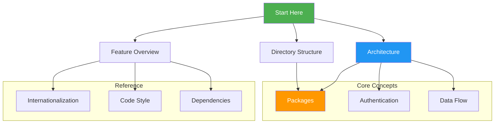
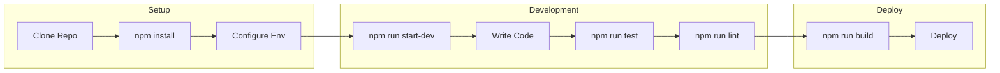

# YourLoops Developer Guide

YourLoops (Blip) is a single-page application built using [React](https://react.dev/) with TypeScript for type 1 diabetes management.

The root-level [README](../README.md) contains the installation, configuration, and commands to accomplish various tasks such as running the tests and building for production.

## Documentation Map



## Recommended Reading Order

### 1. Getting Started
Start with these documents to understand the project:

| Document | Description |
|----------|-------------|
| [Feature Overview](./FeatureOverview.md) | High-level features and user flows |
| [Architecture](./Architecture.md) | Application architecture and patterns |
| [Directory Structure](./DirectoryStructure.md) | Monorepo organization |

### 2. Core Concepts
Understand how the application works:

| Document | Description |
|----------|-------------|
| [Packages](./Packages.md) | The 6 packages and their responsibilities |
| [Authentication](./Authentication.md) | Auth0 integration and user management |
| [Data Flow](DataFlow.md) | Data fetching, processing, and visualization |

### 3. Development Reference
Technical details for daily development:

| Document                                          | Description                           |
|---------------------------------------------------|---------------------------------------|
| [Code Style](./CodeStyle.md)                      | Coding conventions and best practices |
| [Internationalization](./Internationalization.md) | i18next translation system            |

## Quick Links

### Package Documentation
- [yourloops](./Packages.md#1-yourloops) - Main React application
- [medical-domain](./Packages.md#2-medical-domain) - Medical data services
- [dumb](./Packages.md#3-dumb) - Functional UI components
- [tideline](./Packages.md#4-tideline) - D3.js timeline charts
- [viz](./Packages.md#5-viz) - Data visualizations

### Key Files
| File | Purpose |
|------|---------|
| `packages/yourloops/app/app.tsx` | Application entry point |
| `packages/yourloops/app/main-lobby.tsx` | Main routing logic |
| `packages/medical-domain/src/index.ts` | Medical domain API |

## Development Workflow



### Common Commands

```bash
# Start development server
npm run start-dev

# Run all tests
npm run test

# Run specific package tests
npm run test-yourloops
npm run test-medical-domain

# Lint code
npm run lint

# Build for production
npm run build
```

## Getting Help

- Check existing [documentation](./) for answers
- Review [code comments](../packages/yourloops/) in source files
- Look at [test files](../packages/yourloops/test/) for usage examples
