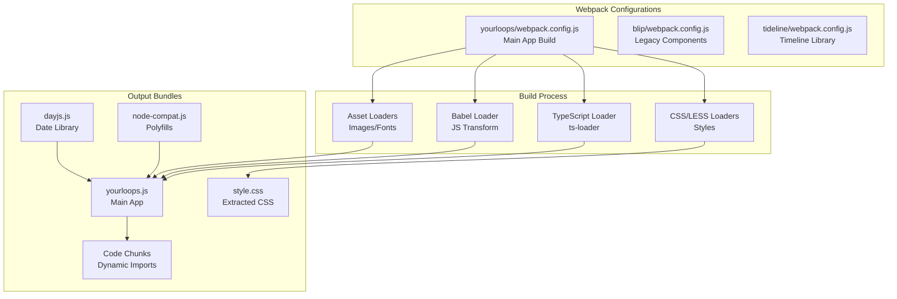
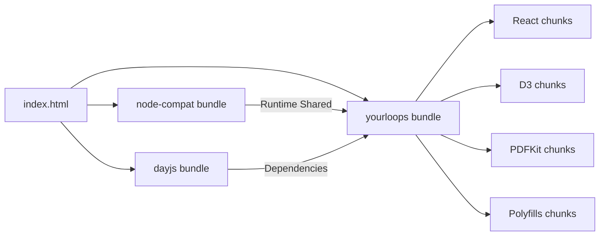
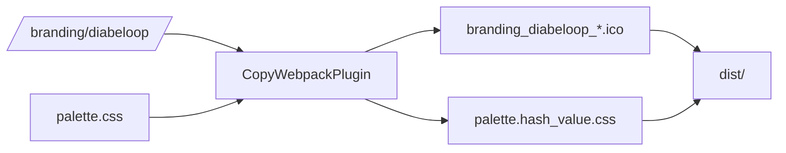
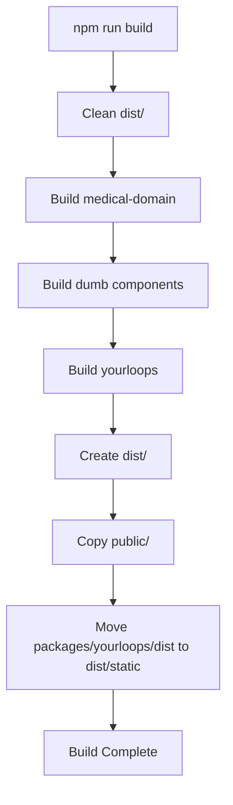

# Webpack Build Configuration

YourLoops uses Webpack 5 as the module bundler for building the application. The build system is configured for a monorepo architecture with multiple packages and specialized build requirements for medical device data visualization.

## Table of Contents

- [Architecture Overview](#architecture-overview)
- [Build Configurations](#build-configurations)
- [Entry Points and Code Splitting](#entry-points-and-code-splitting)
- [Asset Management](#asset-management)
- [Optimization Strategies](#optimization-strategies)
- [Development Server](#development-server)
- [Build Scripts](#build-scripts)

## Architecture Overview



## Build Configurations

### Main Configuration Files

| File | Purpose | Package |
|------|---------|---------|
| `packages/yourloops/webpack.config.js` | Main application build | YourLoops app |
| `packages/blip/webpack.config.js` | Legacy components and utilities | Blip core |
| `packages/tideline/webpack.config.js` | Timeline visualization library | Tideline |
| `webpack.locales-loader.js` | Custom locale bundle loader | Root |

### Build Modes

The webpack configuration supports three modes:

```javascript
// Development mode: Full debugging, fast rebuilds
NODE_ENV=development npm run build

// Production mode: Optimized, minified, hashed assets
NODE_ENV=production npm run build

// Test mode: Inline source maps, no optimization
NODE_ENV=test npm run test
```

## Entry Points and Code Splitting

### Multiple Entry Points Strategy

The main webpack configuration uses a sophisticated entry point strategy to optimize bundle loading:



#### Entry Point Configuration

```javascript
entry: {
  // Node.js polyfills for browser
  nodeCompat: {
    import: 'node-compat.js',
    runtime: false,
    filename: 'node-compat.[contenthash].js'
  },

  // Day.js with all locales
  dayjs: {
    import: ['dayjs/locale/en', 'dayjs/locale/fr', ...],
    runtime: false,
    filename: 'dayjs.[contenthash].js'
  },

  // Main application
  yourloops: {
    import: './app/index.tsx',
    dependOn: ['nodeCompat', 'dayjs'],
    filename: 'yourloops.[contenthash].js'
  }
}
```

### Code Splitting Strategy

Webpack automatically splits code into optimized chunks:

| Cache Group | Purpose | Priority | Example Modules |
|-------------|---------|----------|-----------------|
| `polyfills` | Browser compatibility | 0 | @babel/*, core-js |
| `d3` | Data visualization | 0 | d3-*, tidepool-viz |
| `pdfkit` | PDF generation | 0 | pdfkit |
| `react` | UI framework | 0 | react*, @material-ui |
| `modules` | Other dependencies | -1 | All other node_modules |

## Asset Management

### CSS Extraction

CSS is extracted into separate files to prevent FOUC (Flash of Unstyled Content) and improve caching:

```javascript
// Development: style.css (no hash)
// Production: style.[contenthash].css (cache-busted)
new MiniCssExtractPlugin({
  filename: isDev ? 'style.css' : 'style.[contenthash].css'
})
```

**Benefits:**
- Prevents UI "jump" when fonts load
- Better caching strategy
- Parallel download with JavaScript
- Critical for medical data visualization accuracy

### Branding Assets

YourLoops supports multiple brandings (commercial, clinical, etc.). Assets are dynamically copied:



### Alias Configuration

Webpack aliases simplify imports and enable branding flexibility:

```javascript
alias: {
  'branding/global.css': '../../branding/global.css',
  'cartridge.png': '../../branding/sitechange/cartridge.png',
  'diabeloop-logo.svg': '../../branding/diabeloop/diabeloop-logo.svg',
  // ... many more
}
```

## Optimization Strategies

### Minification

#### JavaScript Minification (Terser)

```javascript
new TerserPlugin({
  parallel: true,              // Use multiple CPU cores
  extractComments: true,       // Separate license file
  terserOptions: {
    toplevel: true,            // Mangle top-level names
    ecma: 2020,                // Target modern browsers
    output: {
      comments: false,         // Remove all comments
      beautify: false          // Minify output
    }
  }
})
```

#### CSS Minification

```javascript
new CssMinimizerPlugin() // Minifies and optimizes CSS
```

### Content Hashing

All production assets use content hashing for optimal caching:

```javascript
// Files only change hash when content changes
filename: '[name].[contenthash].js'
chunkFilename: '[id].[contenthash].js'
assetModuleFilename: '[contenthash][ext]'
```

### Subresource Integrity (SRI)

Production builds include SRI hashes for security:

```javascript
new SubresourceIntegrityPlugin({
  hashFuncNames: ['sha512'],
  enabled: isProduction
})
```

## Development Server

### Configuration

```javascript
devServer: {
  port: 3001,
  compress: false,              // Disable compression in dev
  allowedHosts: 'auto',
  historyApiFallback: true,     // Support client-side routing
  client: {
    progress: true,
    logging: 'verbose'
  }
}
```

### History API Fallback

The dev server rewrites all requests to support React Router:

```javascript
historyApiFallback: {
  rewrites: [
    {
      from: /./,
      to: (context) => {
        // Asset requests: /static/file.js → /file.js
        // Route requests: /patient/data → /
        const basename = path.basename(context.parsedUrl.pathname)
        return basename.indexOf('.') > 0 ? `/${basename}` : '/'
      }
    }
  ]
}
```

## Build Scripts

### Available Commands

| Command                      | Description                        | Environment |
|------------------------------|------------------------------------|-------------|
| `npm run build`              | Build all packages                 | Production  |
| `npm run build -w yourloops` | Build YourLoops only               | Production  |
| `npm run clean`              | Remove build artifacts             | -           |
| `npm run mrproper`           | Deep clean (includes node_modules) | -           |

### Build Workflow



### Build Output Structure

```
dist/
├── index.html                          # Main HTML file
├── yourloops.[hash].js                 # Main app bundle
├── node-compat.[hash].js               # Node.js polyfills
├── dayjs.[hash].js                     # Date library + locales
├── style.[hash].css                    # Extracted CSS
├── polyfills.[hash].js                 # Browser polyfills
├── react.[hash].js                     # React framework
├── d3.[hash].js                        # D3 visualization
├── modules.[hash].js                   # Other dependencies
├── branding_diabeloop_favicon.ico      # Branding assets
└── [id].[hash].js                      # Dynamic chunks
```

## Module Resolution

### Resolve Configuration

```javascript
resolve: {
  extensions: ['.ts', '.tsx', '.js', '.css'],
  alias: { /* branding and package aliases */ },
  fallback: {
    stream: require.resolve('stream-browserify'),
    buffer: require.resolve('buffer')
  },
  symlinks: true,  // Support npm link for development
  cache: true      // Enable module resolution caching
}
```

**Important:** The `symlinks: true` configuration is **essential** for local development with linked packages (tideline, viz, medical-domain).

## Loaders

### TypeScript Loader

```javascript
{
  test: /\.tsx?$/,
  loader: 'ts-loader',
  options: {
    projectReferences: true,  // Support monorepo project references
    configFile: 'tsconfig.json'
  }
}
```

### Babel Loader

Handles legacy JavaScript and JSX transformation:

```javascript
{
  test: /\.js$/,
  exclude: /node_modules(?!.*(tideline|tidepool-viz))/,
  use: {
    loader: 'babel-loader',
    options: {
      rootMode: 'upward',  // Use root babel.config.json
      cacheDirectory: true
    }
  }
}
```

### CSS/LESS Loaders

```javascript
// LESS files (with CSS modules)
{
  test: /\.less$/,
  use: [
    MiniCssExtractPlugin.loader,  // Extract CSS
    'css-loader',                 // Handle @import and url()
    'less-loader'                 // Compile LESS
  ]
}

// Plain CSS files
{
  test: /\.css$/,
  use: [
    MiniCssExtractPlugin.loader,
    'css-loader'
  ]
}
```

### Asset Loaders

```javascript
// Images: Inline as data URLs
{
  test: /\.(gif|jpe?g|png|svg)$/,
  type: 'asset/inline'
}

// Fonts: Inline as data URLs
{
  test: /\.(eot|woff2?|ttf)$/,
  type: 'asset/inline'
}
```

### Custom Locales Loader

YourLoops includes a custom webpack loader for internationalization:

```javascript
{
  test: /locales\/languages\.json$/,
  loader: '../../webpack.locales-loader.js'
}
```

This loader processes language files and bundles only the required locales.

## Environment Variables

### Build-Time Configuration

```javascript
new webpack.DefinePlugin({
  BUILD_CONFIG: JSON.stringify(buildConfig),
  BRANDING_LIST: JSON.stringify(['diabeloop', 'clinical'])
})
```

These constants are replaced at build time and allow conditional logic:

```typescript
if (BUILD_CONFIG.DEV) {
  console.log('Development mode')
}
```

## Performance Considerations

### Bundle Size Optimization

1. **Code Splitting**: Reduces initial load time
2. **Tree Shaking**: Removes unused code (production only)
3. **Chunk Reuse**: Shared dependencies loaded once
4. **Content Hashing**: Enables long-term caching

### Build Performance

1. **ts-loader**: Faster than babel for TypeScript
2. **Cache Enabled**: Module resolution and loaders cached
3. **Parallel Processing**: Terser uses multiple CPU cores
4. **Source Maps**: Inline in dev, external in production

## Troubleshooting

### Common Issues

**Problem**: Webpack can't resolve package imports
```bash
# Solution: Rebuild dependencies
npm run mrproper
npm install
```

**Problem**: Changes not reflected in dev server
```bash
# Solution: Clear webpack cache
rm -rf node_modules/.cache
```

**Problem**: Build fails with TypeScript errors
```bash
# Solution: Check project references
npx tsc --build --clean
npx tsc --build
```

## Related Documentation

- [Package Structure](Packages.md)
- [Directory Structure](DirectoryStructure.md)
- [Development Guide](StartHere.md)
